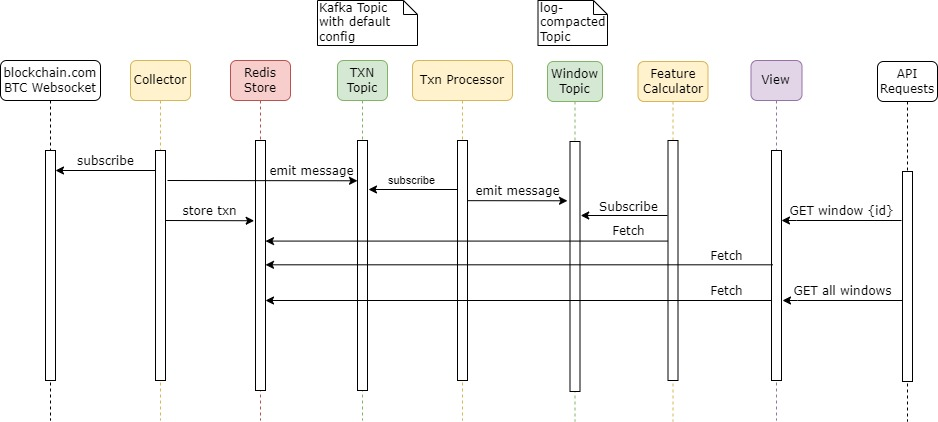

## Aggregator

This repo is a test for event sourcing using Goka and Kafka.

The service is consuming a websocket stream of bitcoin transactions, writing them to a Kafka topic and then aggregates them into a window based on the source address.

Its a merged and refined version [Mike's](https://github.com/mikedewar) repos:
- [BTC Dispersion](https://github.com/mikedewar/btcDispersion)
- [Aggregator](https://github.com/mikedewar/aggregator)

## Architecture

## Currently under development